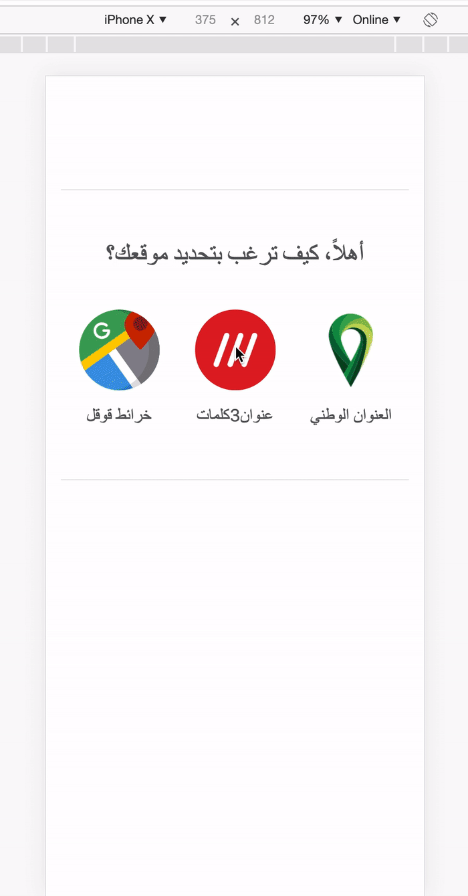
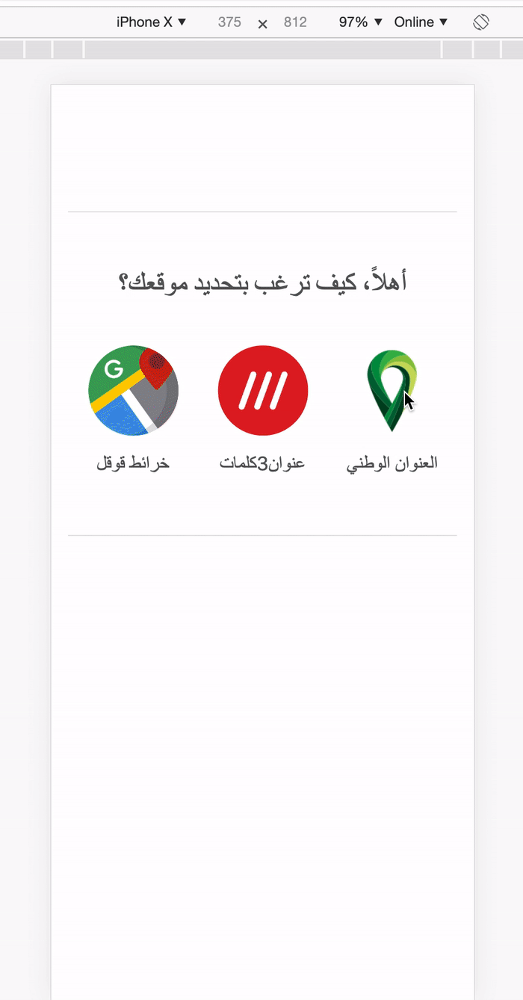
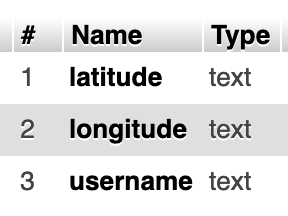
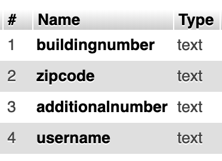

# Delivery location

I made this project to try using public APIs, it's a website where customers can pick their locations to a delivery company using one on of three methods:

#### Google Maps
The user will pin their location in the map, and the latitude and longitude will be saved in the database.
To make the process much easier and faster, the user can enter their country, city and district and the map will automatically zoom to the location they entered.
Note that the country text field will auto-complete by the names of world's countries, and the city text field will auto-complete based on the country the user entered, and the district text field will auto-complete based on the city the user entered.

#### what3words
The user will enter their what3words address, and the website will validate it and save its latitude and longitude if it's a valid address.

#### The Saudi National Address
The user will enter their Saudi National Address, and the website will validate it and save its info if it's a valid address.

## Demo

#### Google Maps


#### what3words


#### The Saudi National Address



## Running locally

### 1. Database setup

You should have am up and running local mysql database with the following details

	username = "root"
	password = "root"
	dbname   = "mymap"


You should have two very simple tables in the db, this is how each of them is structured
 
#### latlngs


#### natadd


### 2. Installation & Development

Clone the repository
```shell
git clone https://github.com/ialmoqren/confirm-location
```

Navigate to the project directory
```shell
cd confirm-location
```

You serve the php project the way you like, but for a quick test run
```shell
php -S localhost:8080
```

Then open the link [http://localhost:8080](http://localhost:8080)
